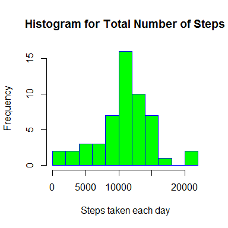
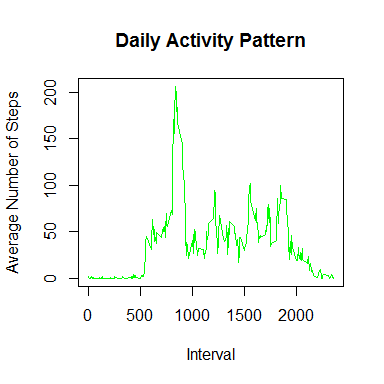
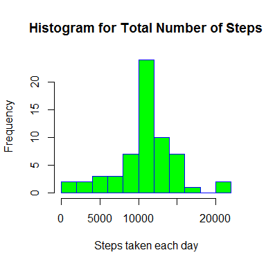
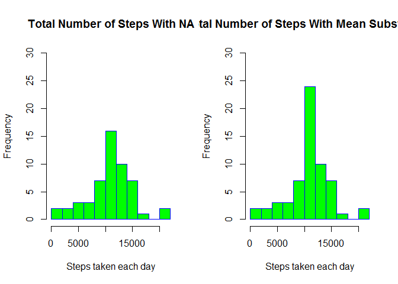

# Reproducible Research: Peer Assessment 1

## Loading and preprocessing the data

* Unzip the file and store information on "data" variable 


```r
unzip ("activity.zip", exdir = ".")
data <- read.csv("activity.csv", na.strings = "NA")
unlink("activity.csv")
```

* Convert dates into the correct format


```r
data$date <- as.Date(as.character(data$date),"%Y-%m-%d")
```


## What is mean total number of steps taken per day?

For this calculations we will ignore the missing values in the dataset.


###1.Histogram of the total number of steps taken each day


```r
totalSteps <- aggregate(steps ~ date + steps, data, FUN=sum)
hist(totalSteps$steps, 
     main="Histogram for Total Number of Steps",
     xlab="Steps taken each day", border="blue", col="green",  breaks=15)
```




###2.The Mean and Median Total Number of Steps Taken Per Day


```r
stepsMean <- round(mean(totalSteps$steps, na.rm = TRUE),0)
stepsMedian <- round(median(totalSteps$steps, na.rm = TRUE),0)
```
The Mean is 1.0766\times 10^{4} and the Median is 1.0765\times 10^{4}.

## What is the average daily activity pattern?

###1.Time series plot of the 5-minute interval and the average number of steps taken, averaged across all days


```r
averageSteps <- aggregate(steps ~ interval + steps, data, FUN=mean)
plot(averageSteps, type = "l", 
     main="Daily Activity Pattern",
     xlab="Interval", col="green",  ylab = "Average Number of Steps")
```



###2.Which 5-minute interval, on average across all the days in the dataset, contains the maximum number of steps?


```r
maxInterval <- averageSteps[which(averageSteps$steps == max(averageSteps$steps, 
                                                            na.rm = TRUE)), ]
```

The 5-miute interval with maximun number of steps in average is the interval 835.


## Imputing missing values

Note that there are a number of days/intervals where there are missing values (coded as NA). The presence of missing days may introduce bias into some calculations or summaries of the data.

###1.Calculate and report the total number of missing values in the dataset


```r
naTotal <- sum(is.na(data))
```

Amount of Missing Values In The Dataset is 2304.


###2. Strategy for filling in all of the missing values in the dataset. The strategy is the following: Use the mean of the 5-minute interval for missing value of that interval


a. Get Missing Values in the dataset

```r
missingValues <- data[is.na(data$steps),]
```

b. For each missing interval value replace it with the correspondant mean


```r
for(i in 1:nrow(missingValues)) {
    
    row <- missingValues[i,]
    
    #Get Mean Interval for missing interval
    aux <- averageSteps[which(averageSteps$interval == row$interval), 2]
    
    #Replace the mising step with the mean
    data$steps[which(is.na(data$steps) & data$interval == row$interval)] <- aux
}
```

###3.New dataset equal to the original but with the missing data filled in.


```r
#Copy DataSet
data2 <- data

for(i in 1:nrow(missingValues)) {
    
    row <- missingValues[i,]
    
    #Get Mean Interval for missing interval
    aux <- averageSteps[which(averageSteps$interval == row$interval), 2]
    
    #Replace the mising step with the mean
    data2$steps[which(is.na(data2$steps) & data2$interval == row$interval)] <- aux

}
```

###4. Make a histogram of the total number of steps taken each day and Calculate and report the mean and median total number of steps taken per day. 


```r
totalSteps2 <- aggregate(steps ~ date + steps, data2, FUN=sum)
hist(totalSteps2$steps, 
     main="Histogram for Total Number of Steps",
     xlab="Steps taken each day", border="blue", col="green",  breaks=15)
```




```r
stepsMean2 <- round(mean(totalSteps2$steps, na.rm = TRUE),0)
stepsMedian2 <- round(median(totalSteps2$steps, na.rm = TRUE),0)
```
The Mean is 1.0766\times 10^{4} and the Median is 1.0765\times 10^{4}.


###Do these values differ from the estimates from the first part of the assignment? 


```r
par(mfrow = c(1,2))

hist(totalSteps$steps, 
     main="Total Number of Steps With NA",
     xlab="Steps taken each day", border="blue", col="green", 
     ylim = c(0,30),  breaks=15)

hist(totalSteps2$steps, 
     main="Total Number of Steps With Mean Substitution",
     xlab="Steps taken each day", border="blue", col="green",  
     ylim = c(0,30), breaks=15)
```

<!-- -->

###What is the impact of imputing missing data on the estimates of the total daily number of steps?

Mean is bigger.


```r
summary(data, na.rm = TRUE)
```

```
##      steps             date               interval     
##  Min.   :  0.00   Min.   :2012-10-01   Min.   :   0.0  
##  1st Qu.:  0.00   1st Qu.:2012-10-16   1st Qu.: 588.8  
##  Median :  0.00   Median :2012-10-31   Median :1177.5  
##  Mean   : 37.38   Mean   :2012-10-31   Mean   :1177.5  
##  3rd Qu.: 12.00   3rd Qu.:2012-11-15   3rd Qu.:1766.2  
##  Max.   :806.00   Max.   :2012-11-30   Max.   :2355.0  
##  NA's   :2304
```

```r
summary(data2, , na.rm = TRUE)
```

```
##      steps             date               interval     
##  Min.   :  0.00   Min.   :2012-10-01   Min.   :   0.0  
##  1st Qu.:  0.00   1st Qu.:2012-10-16   1st Qu.: 588.8  
##  Median :  0.00   Median :2012-10-31   Median :1177.5  
##  Mean   : 37.38   Mean   :2012-10-31   Mean   :1177.5  
##  3rd Qu.: 27.00   3rd Qu.:2012-11-15   3rd Qu.:1766.2  
##  Max.   :806.00   Max.   :2012-11-30   Max.   :2355.0
```


## Are there differences in activity patterns between weekdays and weekends?
